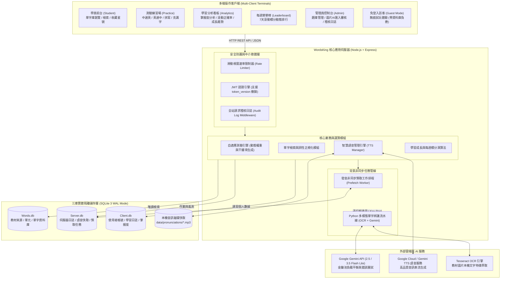
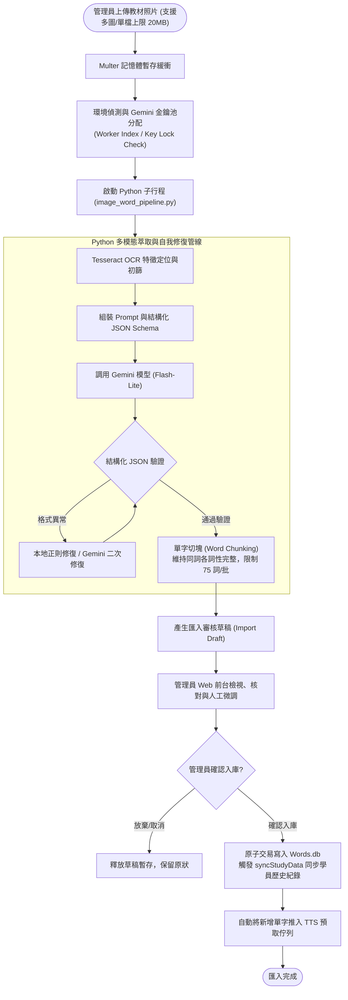
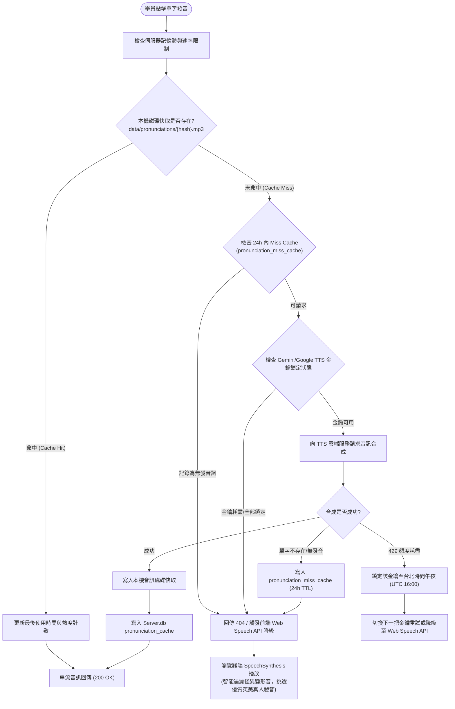
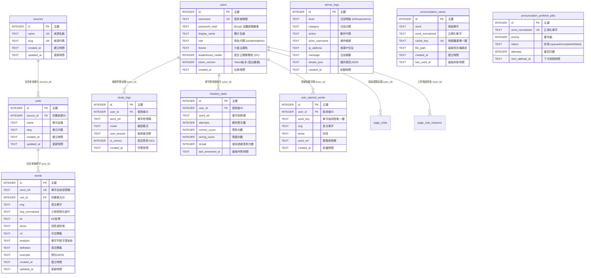

# Words King Server

> **多模態 AI 萃取驅動、三庫實體隔離與自適應認知學習之現代化英語學習與沉浸式測驗伺服器**

[](https://nodejs.org/)
[](https://expressjs.com/)
[-003B57?style=flat-square&logo=sqlite)](https://www.sqlite.org/wal.html)
[](https://ai.google.dev/)
[](https://developer.mozilla.org/zh-TW/docs/Web/JavaScript)
[-brightgreen?style=flat-square)](scripts/test-isolated.js)
[](LICENSE)

---

## 目錄 (Table of Contents)

1. [系統架構 (Architecture)](#1-系統架構-architecture)
   - 1.1 [系統拓撲與分層架構 (System Topology and Layering)](#11-系統拓撲與分層架構-system-topology-and-layering)
   - 1.2 [多模態 AI 萃取與匯入審核工作流 (Multimodal AI Extraction and Ingestion Pipeline)](#12-多模態-ai-萃取與匯入審核工作流-multimodal-ai-extraction-and-ingestion-pipeline)
   - 1.3 [智慧多階層發音快取與非同步預取機制 (Multi-Tier TTS Engine and Prefetch Worker)](#13-智慧多階層發音快取與非同步預取機制-multi-tier-tts-engine-and-prefetch-worker)
   - 1.4 [自適應測驗引擎與認知學習演算法 (Adaptive Practice Engine and Mastery Algorithm)](#14-自適應測驗引擎與認知學習演算法-adaptive-practice-engine-and-mastery-algorithm)
   - 1.5 [核心工程機制與架構權衡 (Key Engineering Mechanisms and Technical Trade-Offs)](#15-核心工程機制與架構權衡-key-engineering-mechanisms-and-technical-trade-offs)
   - 1.6 [三庫實體隔離資料庫綱要與實體關聯模型 (Tri-Database Architecture, Schema and ERD)](#16-三庫實體隔離資料庫綱要與實體關聯模型-tri-database-architecture-schema-and-erd)
2. [如何啟動 (Getting Started)](#2-如何啟動-getting-started)
   - 2.1 [環境先決條件 (Prerequisites)](#21-環境先決條件-prerequisites)
   - 2.2 [本機啟動步驟 (Quick Start Commands)](#22-本機啟動步驟-quick-start-commands)
   - 2.3 [環境變數配置詳解 (Environment Variables Configuration)](#23-環境變數配置詳解-environment-variables-configuration)
   - 2.4 [自動化測試與安全隔離機制 (Automated Testing and Isolation)](#24-自動化測試與安全隔離機制-automated-testing-and-isolation)
   - 2.5 [角色權限矩陣與帳號管理 (Role and Permission Matrix)](#25-角色權限矩陣與帳號管理-role-and-permission-matrix)
   - 2.6 [主要服務端點與展示 (Service Endpoints and Showcase)](#26-主要服務端點與展示-service-endpoints-and-showcase)
3. [參考文獻 (References)](#3-參考文獻-references)

---

## 1. 系統架構 (Architecture)

### 1.1 系統拓撲與分層架構 (System Topology and Layering)

WordsKingServer 採用現代化**分層邊緣運算拓撲 (Tiered Edge & Application Topology)**。系統結合原生免建置純前端、高吞吐 Express 核心中介軟體管線、Python 多模態 AI 萃取子系統，以及創新的**三庫實體隔離 SQLite 儲存層**：



- **三庫實體隔離原則 (Tri-Database Separation)**：將業務字典 (`Words.db`)、伺服器遙測快取 (`Server.db`) 與使用者學習個資 (`Client.db`) 在實體檔案層面嚴格分離。字典庫更新或重構時完全不干擾學員歷史作答足跡與系統運作日誌。
- **邊緣零打包純前端 (Zero-Build Frontend)**：全站靜態資源採用 Vanilla HTML5/ES6+/CSS3，原生支援深淺色及大地色等五款主題，首頁與功能頁載入均在毫秒級完成，消除重型 SPA 的打包開銷與白屏問題。

---

### 1.2 多模態 AI 萃取與匯入審核工作流 (Multimodal AI Extraction and Ingestion Pipeline)

針對紙本教材、掃描照片與數位講義，系統設計了具備**斷點續傳 (Resumable)** 與**人機協同審核 (Human-in-the-Loop)** 的多模態萃取流水線：



#### 核心技術特色
- **智慧單字切塊 (Word Chunking)**：限制每批至多 75 個獨立單字與 120 列來源資料，強制確保同一單字的所有不同詞性與變體收斂於同一批次處理，避免語意撕裂。
- **容錯與自我修復機制 (Multi-Pass Repair)**：若模型產出未完全符合標準 JSON，管線首先執行本機正則表達式修正；若仍無效則發動二次精準修復請求，確保萃取成功率。
- **資料防護與無損同步 (`syncStudyData`)**：當教材內容修訂入庫時，透過全域單字雜湊參照碼 (`word_ref`) 比對，自動遷移使用者的精熟度統計與歷史作答記錄，避免重複學習與歷史資料遺失。

---

### 1.3 智慧多階層發音快取與非同步預取機制 (Multi-Tier TTS Engine and Prefetch Worker)

為了解決高頻單字發音帶來的延遲與 API 額度消耗，WordsKing 實作了四階發音調度架構：



- **金鑰冷卻鎖定 (Key Lock Window)**：遇到每日配額用盡 (429/Quota) 時，自動計算當前至台北時間午夜（UTC 16:00）的剩餘時間，對特定金鑰加鎖，無縫切換備用金鑰。
- **負載快取防護 (Miss Cache)**：針對合成失敗或無效詞彙設定 24 小時快取，避免重複呼叫浪費額度。
- **無縫前端語音降級與聲音過濾**：當後端音訊完全不可用時，前端無縫降級至瀏覽器原生 `SpeechSynthesis`，並以演算法排除系統搞笑與變形語音，確保最佳學習體驗。

---

### 1.4 自適應測驗引擎與認知學習演算法 (Adaptive Practice Engine and Mastery Algorithm)

系統提供四種測驗模式，並結合艾賓浩斯遺忘曲線與自適應加權邏輯：

1. **中選英 (zh_to_en)**：顯示中文釋義與詞性，自候選詞庫挑選最貼切之英文單字（含混淆項生成）。
2. **英選中 (en_to_zh)**：顯示英文單字與音標，進行中文語意辨識。
3. **看中拼英 (type_en_from_zh)**：強化主動拼寫記憶，後端進行標點去除與字元正規化比對。
4. **克漏字例句填空 (cloze_en)**：動態將例句核心單字挖空，結合前後文語意挑選填空答案。

#### 認知學習與精熟度演算法重點
- **永久首答正確性保障 (Permanent First Correct)**：每一個單字在該名學員的學習生涯中，首次答對紀錄具備不可竄改性與跨模式獨立性，誠實紀錄真實掌握歷程。
- **自適應動態題庫權重**：依據 `mastery_stats` 記錄之答錯率、答題次數與連續答對次數動態微調：
  $$\text{Weight} = \max\left(1, \text{WrongCount} \times 2 - \text{Streak}\right)$$
  高頻錯誤單字將以更高機率優先出現，直至建立長期記憶。
- **7 天滾動加權正確率 (Rolling Accuracy)**：綜合計算過去一週作答與活躍度，配合台灣日曆時區進行切分，確保排行榜與趨勢分析的時效與公正。

---

### 1.5 核心工程機制與架構權衡 (Key Engineering Mechanisms and Technical Trade-Offs)

| 評估維度 | WordsKingServer 選型 | 傳統/重型替代方案 | 關鍵選型理由與架構權衡 (Trade-Offs) |
| :--- | :--- | :--- | :--- |
| **資料庫架構** | **三庫實體隔離 SQLite 3 (WAL)** | 單一大型 PostgreSQL / MySQL | **關注點完全分離、零連線池負載、無損備份**。字典資料 (`Words.db`) 屬靜態教材，可單獨版本化；日誌與語音快取 (`Server.db`) 屬伺服器遙測；學員隱私 (`Client.db`) 獨立維護。 |
| **前端架構** | **原生 Vanilla ES6+ HTML5/CSS** | React / Vue / Next.js SPA | **零構建步驟、首屏秒開、極高可維護性**。免除 Node.js 前端打包版本相衝，手機與桌面瀏覽器皆可輕量快速渲染，支援深淺主題切換。 |
| **AI 萃取架構** | **Gemini Flash-Lite + Tesseract** | 傳統純人工錄入 / 重型 OCR 伺服器 | **高精度結構化、低建置成本**。利用多模態模型理解複雜講義格式與例句，並透過自動自我修復正則確保資料結構 100% 正確。 |
| **語音架構** | **多階層磁碟快取 + 智慧降級** | 即時即用直連第三方 TTS | **節省 90% 以上 API 呼叫成本、消除音訊延遲**。熱門字彙全數快取至本地磁碟，離峰非同步預取，斷網或額度耗盡時無感降級。 |
| **工作階段安全** | **無狀態 JWT + token_version** | 傳統集中式 Redis Session | **輕量高效、支援全局密碼重設吊銷**。驗證時比對使用者表之版本號，若密碼修改或管理員強制登出，立即秒級失效，免除維運 Redis 的開銷。 |
| **訪客模式體驗** | **完全無痕 Stateless Guest Token** | 資料庫建立臨時 Guest 帳號 | **防止資料庫膨脹、保護系統安全**。訪客享有所有單字瀏覽、發音聆聽與測驗練習功能，但完全不寫入 `Client.db`，確保資料庫清潔。 |

---

### 1.6 三庫實體隔離資料庫綱要與實體關聯模型 (Tri-Database Architecture, Schema and ERD)

系統將所有資料嚴格拆解至三個獨立 SQLite 資料庫（均開啟 `PRAGMA journal_mode = WAL` 與 `PRAGMA foreign_keys = ON`）：



---

## 2. 如何啟動 (Getting Started)

### 2.1 環境先決條件 (Prerequisites)

- **Node.js**：`v18.0.0` 或更高版本（建議使用 `v20 LTS` 或 `v22 LTS`）
- **npm**：`v9.0.0` 或更高版本
- **Python**（選用，僅於執行圖片多模態 OCR + AI 匯入時需要）：`Python 3.10+`
- **Tesseract OCR**（選用，僅於圖片辨識前處理時需要）：需安裝於作業系統並設定路徑

---

### 2.2 本機啟動步驟 (Quick Start Commands)

```bash
# 1. 複製專案庫
git clone https://github.com/ytconch/WordsKing.git
cd WordsKingServer

# 2. 安裝核心相依套件
npm install

# 3. 配置環境變數
cp .env.example .env
# Windows PowerShell 可執行: Copy-Item .env.example .env

# 4. (選用) 安裝圖片 AI 匯入之 Python 相依套件
pip install -r requirements-image-import.txt

# 5. 執行自動化測試 (驗證 27 項資料庫隔離與自適應演算法測試)
npm test

# 6. 啟動伺服器 (生產模式)
npm start

# 或是以開發模式啟動 (支援檔案變更熱重載)
npm run dev
```

啟動完成後，開啟瀏覽器造訪：`http://localhost:3000/home.html`

---

### 2.3 環境變數配置詳解 (Environment Variables Configuration)

專案根目錄下的 `.env` 檔案控制後端行為與第三方 API 整合：

| 環境變數名稱 | 必填/選填 | 預設值 | 說明與配置範例 |
| :--- | :---: | :--- | :--- |
| `PORT` | 選填 | `3000` | 伺服器監聽之 HTTP 連接埠。 |
| `JWT_SECRET` | **必填** | *(無)* | JWT 簽章密鑰，若未填寫伺服器將拒絕啟動以策安全。 |
| `GEMINI_MODEL` | 選填 | `gemini-3.5-flash-lite` | 用於單字結構化萃取之模型代碼。 |
| `GEMINI_API_KEYS` | 選填 | *(無)* | Gemini API 金鑰池，支援逗號、分號或換行分隔多組金鑰以實作負載平衡與配額輪替。 |
| `GOOGLE_TTS_API_KEY`| 選填 | *(無)* | Google Cloud Text-to-Speech API 金鑰。若無則自動使用 Gemini 或前端降級。 |
| `GOOGLE_TTS_LANGUAGE_CODE` | 選填 | `en-US` | 預設發音語言代碼。 |
| `GOOGLE_TTS_VOICE` | 選填 | *(系統自動)* | 指定之 Google TTS 聲音模型代碼。 |
| `TESSERACT_CMD` | 選填 | `C:\Program Files\Tesseract-OCR\tesseract.exe` | 本機 Tesseract 執行檔絕對路徑。 |

---

### 2.4 自動化測試與安全隔離機制 (Automated Testing and Isolation)

本專案建置了嚴謹的隔離式測試套件 (`scripts/test-isolated.js`)，於獨立的暫存目錄中動態建立拋棄式 SQLite 實例，**保證絕不污染或覆蓋 `data/*.db` 正式資料**：

```bash
# 執行全套件測試
npm test
```

測試套件涵蓋 27 項核心合約與回歸檢驗：
- 永久首答正確性機制 (Permanent First Correct)
- 滾動 7 天加權正確率與歷史時區計算
- 訪客模式 (Guest Mode) 零資料庫寫入合約
- 單字分塊 (Word Chunking) 與斷點續傳狀態一致性
- 多階層 TTS 聲音降級與怪異變形音過濾邏輯
- 詞性獨立之星號收藏 (Starred Words POS Isolation)
- 停留時間與頁面瀏覽軌跡統計報告

---

### 2.5 角色權限矩陣與帳號管理 (Role and Permission Matrix)

| 角色組別 | 認證方式 | 專屬操作頁面 | 權限範圍與職責邊界 |
| :--- | :--- | :--- | :--- |
| **訪客 (Guest)** | 免註冊、免登入 (一鍵體驗) | `/home.html`, `/words.html`, `/practice.html` | 可自由瀏覽單字、聆聽發音、進行四種測驗練習；數據保存在前端，不寫入資料庫。 |
| **學員 (Student)** | 帳號密碼登入 (JWT 憑證) | `/words.html`, `/practice.html`, `/analytics.html`, `/leaderboard.html`, `/settings.html` | 具備完整歷史作答追蹤、單字熟練度分析、收藏清單管理、每週排行榜競爭與個人主題設定。 |
| **管理員 (Admin)** | 具備管理員權限之帳號 | `/admin.html` 以及所有學員頁面 | 具備單字庫 CRUD、Excel 批次匯入、多模態圖片 AI 辨識與審核草稿核定、系統稽核日誌調閱、帳號重設審核。 |

---

### 2.6 主要服務端點與展示 (Service Endpoints and Showcase)

| 服務端點 URL | 頁面功能 | 特色說明 |
| :--- | :--- | :--- |
| `http://localhost:3000/home.html` | **學習大廳首頁** | 系統概覽、快速開始、學習指引與模式導航。 |
| `http://localhost:3000/words.html` | **單字探索庫** | 來源與單元篩選、即時模糊檢索、詞性分類、音標與釋義查閱、星號收藏。 |
| `http://localhost:3000/practice.html` | **沉浸式測驗場** | 支援「中選英」、「英選中」、「看中拼英」與「克漏字例句填空」四合一模式。 |
| `http://localhost:3000/analytics.html`| **學習成長戰情** | 個人精熟度等級、連續答對天數、滾動正確率、學習趨勢折線圖。 |
| `http://localhost:3000/leaderboard.html` | **每週榮譽榜** | 全體學員 7 天滾動活躍度與準確率動態排行（支援個人匿名保護）。 |
| `http://localhost:3000/settings.html` | **個人化偏好** | 支援 Sage、Paper、Ocean、Light、Dark 五款主題，以及發音速率與音量調節。 |
| `http://localhost:3000/notifications.html` | **站內訊息中心** | 管理員公告與個人密碼重設結果即時通知接收。 |
| `http://localhost:3000/admin.html` | **管理後台控制台** | 單字庫維護、圖片 AI 匯入工作站、伺服器即時運作日誌與線上停留分析。 |

---

## 3. 參考文獻 (References)

1. **資料庫交易處理與預寫日誌架構 (WAL & ACID Principles)**  
   Gray, J., & Reuter, A. (1992). *Transaction Processing: Concepts and Techniques*. Morgan Kaufmann Publishers.  
   Hipp, D. R., et al. (2010). *Write-Ahead Logging in SQLite3*. SQLite Consortium.  
   URL: [https://www.sqlite.org/wal.html](https://www.sqlite.org/wal.html)

2. **認知負荷理論與間隔重複記憶模型 (Cognitive Psychology & Spaced Repetition)**  
   Ebbinghaus, H. (1885). *Memory: A Contribution to Experimental Psychology*. Teachers College, Columbia University.  
   Sweller, J. (1988). *Cognitive Load During Problem Solving: Effects on Learning*. Cognitive Science, 12(2), 257-285.  
   Leitner, S. (1972). *So lernt man lernen (How to Learn to Learn)*. Herder.

3. **RESTful 架構風格與無狀態 API 設計原則 (REST Architecture & Stateless Design)**  
   Fielding, R. T. (2000). *Architectural Styles and the Design of Network-based Software Architectures*. Doctoral dissertation, University of California, Irvine.  
   URL: [https://www.ics.uci.edu/~fielding/pubs/dissertation/top.htm](https://www.ics.uci.edu/~fielding/pubs/dissertation/top.htm)

4. **JSON Web Token (JWT) 安全標準與工作階段即時撤銷機制**  
   Jones, M., Bradley, J., & Sakimura, N. (2015). *JSON Web Token (JWT)*. IETF RFC 7519.  
   DOI: [10.17487/RFC7519](https://doi.org/10.17487/RFC7519)

5. **神經語音合成技術與多層快取調度 (Neural Text-to-Speech & Speech Synthesis)**  
   van den Oord, A., Dieleman, S., Zen, H., et al. (2016). *WaveNet: A Generative Model for Raw Audio*. arXiv:1609.03499.  
   Google Cloud. (2024). *Text-to-Speech API Architecture and Audio Synthesis Best Practices*. Google Cloud Documentation.  
   URL: [https://cloud.google.com/text-to-speech/docs](https://cloud.google.com/text-to-speech/docs)

6. **多模態大型語言模型結構化資訊萃取與光學字元辨識技術 (Multimodal LLM & OCR Integration)**  
   Gemini Team, Google. (2024). *Gemini: A Family of Highly Capable Multimodal Models*. arXiv:2312.11805.  
   Smith, R. (2007). *An Overview of the Tesseract OCR Engine*. Ninth International Conference on Document Analysis and Recognition (ICDAR 2007). IEEE.  
   DOI: [10.1109/ICDAR.2007.4378689](https://doi.org/10.1109/ICDAR.2007.4378689)
